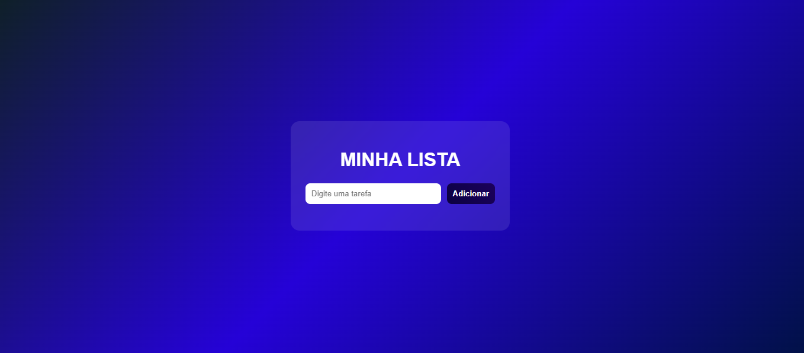

# 🚀 To-Do List Interativa

Uma aplicação simples e funcional de lista de tarefas desenvolvida com foco em aprendizado prático de Front-End.

---

## 🧠 Sobre o Projeto

Este projeto foi criado com o objetivo de praticar conceitos fundamentais de desenvolvimento web, como manipulação do DOM, eventos e organização de código.

---

## ⚙️ Tecnologias Utilizadas

- HTML5  
- CSS3  
- JavaScript  

---

## ✨ Funcionalidades

✔ Adicionar tarefas  
✔ Marcar tarefas como concluídas  
✔ Remover tarefas  
✔ Interface moderna com efeito visual (glassmorphism)  

---

## 🎯 Objetivo

Evoluir na área de desenvolvimento Front-End, construindo projetos práticos que simulam situações reais do mercado.

---

## 📸 Preview

---

## 📚 Aprendizados

Durante esse projeto, desenvolvi:

- Manipulação de elementos com JavaScript  
- Uso de eventos (click)  
- Organização de código  
- Estruturação de layout com HTML e CSS  

---

## 🔥 Próximas melhorias

- [ ] Salvar tarefas no navegador (LocalStorage)  
- [ ] Responsividade para mobile  
- [ ] Melhorias visuais e animações  

---

## 👨‍💻 Autor

Desenvolvido por Diego 🚀  